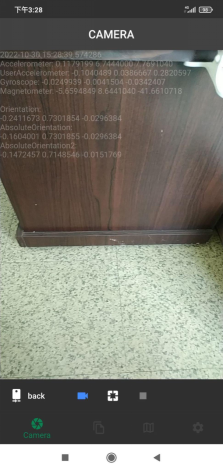
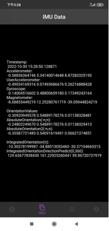
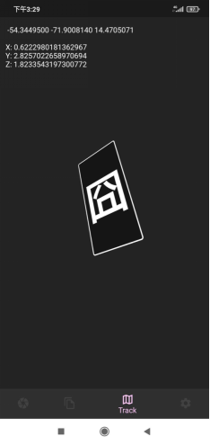
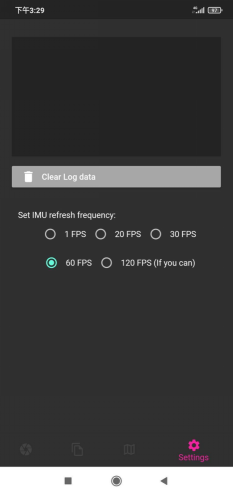

# Android Data Logger

A Flutter project for record dataset from your smart phone. Including Accelerometer, User Accelerometer, Gyroscope ,Magnetometer and current camera data.

The APK file has been packaged into the [Release Logger v3.5.3 · MVR3DR-MonocularVRSpace3DReconstruction/0100-Tools-Android_data_logger (github.com)](https://github.com/MVR3DR-MonocularVRSpace3DReconstruction/0100-Tools-Android_data_logger/releases/tag/v3.5.3)
You may download and installed directly.

Basically we log the video and mapping the frames with logged IMU data via timestamps. 
Process these data with **[0000-1000-Data_pretreatment](https://github.com/MVR3DR-MonocularVRSpace3DReconstruction/0000-1000-Data_pretreatment)**  ‘s imu.py.
Unfortunately we didn’t provide any « pose to camera matrix function » in these project and you may found some references in [2100-Global_Scene_Registration/rtvec2extrinsic.py at main · MVR3DR-MonocularVRSpace3DReconstruction/2100-Global_Scene_Registration (github.com)](https://github.com/MVR3DR-MonocularVRSpace3DReconstruction/2100-Global_Scene_Registration/blob/main/rtvec2extrinsic.py)

### SDK Version

>   Flutter 2.5.0 • channel stable • https://github.com/flutter/flutter.git
>   Framework • revision 4cc385b4b8 (1 year, 3 months ago) • 2021-09-07 23:01:49 -0700
>   Engine • revision f0826da7ef
>   Tools • Dart 2.14.0

### Snapshot









### Data

The data logged will store in « /storage/emulated/0/Download/Logger/ »
User can clear & copy data via file explorer.

### Edit

You can edit log data by change different variables in **imuSink.write()**

```dart
if (controller.value.isRecordingVideo) {
      File imuFile = File(logPath);
      IOSink imuSink = imuFile.openWrite(mode: FileMode.append);
      imuSink.write('$timestamp\n'
          '$strAccelerometer\n'
          '$strUserAccelerometer\n'
          '$strGyroscope\n'
          '$strMagnetometer\n'

          '$strOrientation\n'
          '$strAbsoluteOrientation\n'
          '$strAbsoluteOrientation2\n'
          '\n');
      imuSink.close();
    }
```


## Getting Started

This project is a starting point for a Flutter application.

A few resources to get you started if this is your first Flutter project:

- [Lab: Write your first Flutter app](https://flutter.dev/docs/get-started/codelab)
- [Cookbook: Useful Flutter samples](https://flutter.dev/docs/cookbook)

For help getting started with Flutter, view our
[online documentation](https://flutter.dev/docs), which offers tutorials,
samples, guidance on mobile development, and a full API reference.
